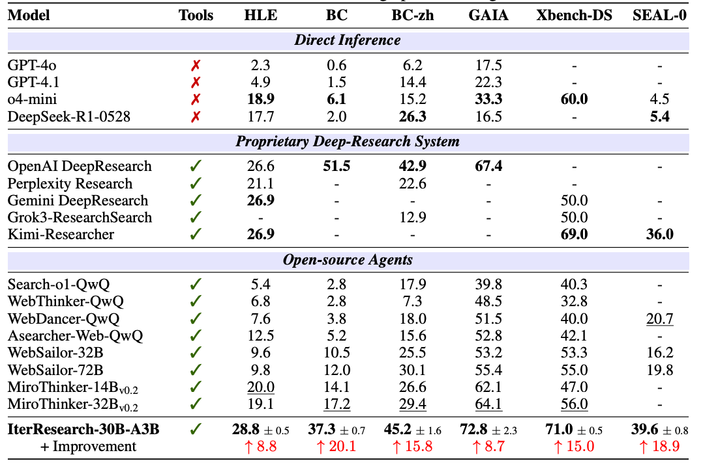

## Overview

Recent advances in deep-research agents have shown promise for autonomous
knowledge construction through dynamic reasoning over external sources. However, existing approaches rely on a mono-contextual paradigm that accumulates
all information in a single, expanding context window, leading to context suffocation and noise contamination that limit their effectiveness on long-horizon
tasks. We introduce IterResearch, a novel iterative deep-research paradigm that
revisits long-horizon research through the lens of Interaction Scaling. Instead of
relying on linear context accumulation, we adopt an MDP-inspired architecture
with strategic workspace reconstruction. By maintaining an evolving report as
memory and periodically synthesizing insights, our approach preserves consistent reasoning capacity across arbitrary exploration depths. To effectively train
this paradigm, we employ Efficiency-Aware Policy Optimization (EAPO), a training strategy that adapts geometric reward discounting to incentivize efficient exploration and utilizes adaptive downsampling for stable distributed training. Extensive experiments demonstrate that IterResearch achieves substantial improvements over existing open-source agents with average +14.5pp across six benchmarks and narrows the gap with frontier proprietary systems. Remarkably, our
paradigm exhibits unprecedented interaction scaling, extending to 2048 interactions with dramatic performance gains (from 3.5% to 42.5%), and serves as an effective prompting strategy, improving frontier models by up to 19.2pp over ReAct
on long-horizon tasks. These findings position IterResearch as a versatile solution
for long-horizon reasoning, effective both as a trained agent and as a prompting
paradigm for frontier models.

## Key Features

- We propose **IterResearch**, a novel iterative deep-research paradigm that revisits long-horizon
research through an MDP-based formalism, maintaining sustained reasoning capacity through
periodic synthesis and an evolving report memory—eliminating the context suffocation and noise
contamination that plague mono-contextual approaches.
- We employ **Efficiency-Aware Policy Optimization (EAPO)** which adapts geometric discounted
rewards that incentivize efficient exploration and utilizes adaptive downsampling for stable distributed training, enabling effective learning from our paradigm’s unique trajectory structure.
- We demonstrate IterResearch’s **exceptional capabilities and broader impact**: (1) achieving an average 14.5 pp improvement across six challenging benchmarks; (2) exhibiting interaction scaling
to 2048 interactions with dramatic performance gains; (3) enabling cross-paradigm knowledge
transfer to enhance mono-contextual agents; (4) providing a model-agnostic prompting strategy
that significantly improves frontier models on long-horizon tasks without training.

## Overall Performance

## Main Results

## Ablation Studies

## Performance comparison between IterResearch and ReAct as Prompting Strategies

## Links

- [Dataset on HuggingFace](https://huggingface.co/datasets/awe-ai/swe-data)
- [Pipeline Documentation](https://awe-ai.example.com/docs/data-engine)
