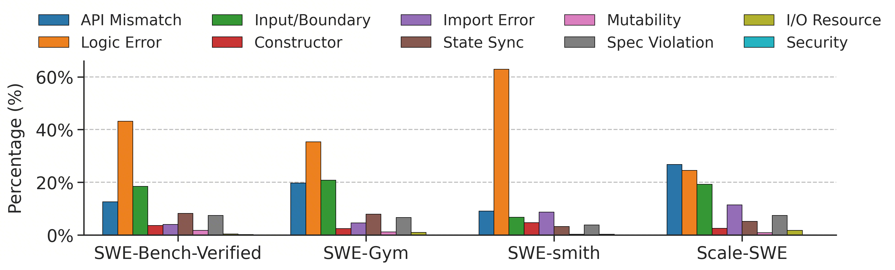
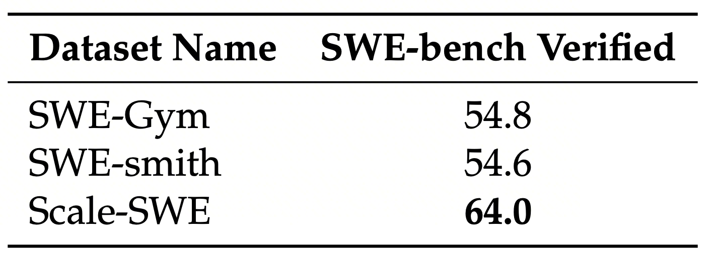

**Paper Link:** https://arxiv.org/abs/2602.09892

**Repository Link:** https://github.com/AweAI-Team/ScaleSWE

**Data Link:** https://huggingface.co/datasets/Awe-AI/Scale-SWE

We propose the **Scale-SWE** dataset. By utilizing a Sandboxed multi-agent system, we achieved the scaling of SWE tasks to construct 100k real SWE data points, creating the **largest open-source high-quality SWE dataset** to date. This makes it possible to fully train Code Agents on GitHub-scale data.

Furthermore, by utilizing distilled data to train **Qwen3-30A3B-Instruct**, we achieved a score of **64% on SWE-bench-Verified**. This makes it possible for academic models of the same size to **surpass industrial models** (such as GLM-4.7-Flash)!

## 1. The Importance of Real-World SWE Data

There have been previous works, such as SWE-smith and SWE-Mirror, which utilized automated workflows to generate synthetic data, achieving the scaling of SWE data. It was possible to construct tens of thousands of SWE data points using only a small number of repositories. For instance, SWE-smith used 128 repositories to construct 50k data points. The advantage of this approach is the relatively simple and rapid realization of data scaling.

However, previous analysis (e.g., BugPilot) observed that the data distribution of synthetic datasets is extremely unbalanced, which aligns with our classification results shown below:

It can be seen that compared to real data, the vast majority of data types in SWE-smith are concentrated on logic errors. Other real-world datasets, such as Scale-SWE and SWE-Gym, exhibit a relatively balanced category distribution. Real data is better able to approximate the data category distribution of real-world scenarios.

## 2. Why Real-World SWE Data Has Not Been Scaled Before

### (1) Complexity of Environment Configuration

Previous data often focused on relatively few repositories with relatively simple environment configurations. The advantage is that most pull requests could likely rely on the same, relatively simple trajectories to achieve environment configuration. However, simply choosing repositories with simple environment configurations (e.g., directly executing `pip install -e .`) makes it impossible to achieve large-scale dataset construction, as the environment configuration for most repositories on GitHub is not that simple. Most previous methods were based on rules or single-turn LLM dialogue forms to generate files similar to `requirements.txt`. For complex environment configurations, such methods make it difficult to execute test scripts in real-time to verify if the environment is configured successfully and then adjust the configuration based on feedback errors.

### (2) Scarcity of Unit Tests

For SWE tasks, unit tests are critical, including Fail-to-Pass (F2P) and Pass-to-Pass (P2P). However, many developers nowadays no longer have the habit of writing unit tests casually, which poses a severe challenge for constructing real SWE data. We observed that a large number of precious high-quality pull requests do not include unit tests. Previous SWE dataset construction methods only retained unit tests inserted by authors in the pull request, which led to the loss of a large volume of high-quality pull requests.

### (3) Rigor of Problem Statements

A large number of pull requests are actually not associated with issues. To construct the problem statement in SWE tasks, previous work often provided the content of the pull request dialogue and other meta-information to the LLM to generate the problem statement. At the same time, the pull request itself consists of the code and description submitted by the author after solving the problem. If given directly to the large model to generate a problem statement, it can easily lead to leakage, such as leaking the location of the bug or the solution.

## 3. The Scale-SWE Method

To address the above problems, we propose a multi-agent workflow operating within a sandbox. This includes the **Environment Builder Agent**, **Unit-test Creator Agent**, and **Problem Statement Writer Agent**.

### (1) Environment Builder Agent (EBA)

Compared to previous methods, the EBA can freely explore the repository structure in the sandbox, finding and reading files related to environment configuration, such as `README.md`, `setup.py`, `pyproject.toml`, etc. Additionally, the EBA can execute `pytest` or other scripts after configuration to test whether the environment was truly successfully configured. If there are errors during execution, it can continue to adjust the environment configuration based on the error results.

### (2) Unit-test Creator Agent (UCA)

Since a large number of high-quality pull requests lack unit tests contributed by the authors, we need to construct unit tests ourselves. The UCA can explore the structure code of the repository in the sandbox, write F2P/P2P code based on the diff situation of the pull request, and then verify if F2P is truly achieved by switching commits and running test cases. If the results do not meet the definition of F2P/P2P, it can continue to adjust the code of the test cases.

### (3) Problem Statement Writer Agent (PSWA)

For SWE task data, the problem statement is an extremely important link. On one hand, it directly determines the agent's behavior; on the other hand, it lacks rule-based verification methods (environment and unit tests can be verified by rules such as directly executing `pytest`). We conducted internal lightweight ablation studies (not extremely rigorous) and found that the quality of the problem statement has a huge impact on the performance of the model after SFT (close to 10% on SWE-bench-Verified).

High-quality problem statements mainly have two considerations: 1. Must not leak F2P, bug location, or solutions. 2. The instructions and semantics of the problem statement must be consistent with F2P. That is to say, it must ensure that the problem statement is truly describing the bug/feature completely and comprehensively. However, to enable the PSWA to describe it completely, it is necessary to provide all the diff information of the F2P and the corresponding pull request to the PSWA. This makes it easy for the PSWA to leak information in the problem statement. Therefore, the PSWA's prompt and the model's instruction-following capability are crucial.

For the PSWA, to ensure strong instruction following and logical ability to prevent information leakage, we adopted **Gemini3-Pro** as the driving model for the Agent. We observed that even GPT 5.1 or DeepSeek v3.2 might exhibit phenomena of leaking bug locations or solutions.

Statistics of the distilled data are shown in the figure below:

  

It can be seen that Scale-SWE data requires more turns and tokens for DeepSeek v3.2 to solve during the distillation process. This can also reflect the leakage situation from one aspect, because if the problem statement had leaks, it would naturally require fewer turns to explore the repository and fewer turns to verify and fix the code.

## 4. Results

To verify the effectiveness of Scale-SWE data, we used **DeepSeek v3.2** for distillation. We obtained 71k successful trajectories and performed SFT based on **Qwen3-30B-A3B-Instruct**. The results are as follows:

  

It can be seen that for models of the same scale, such as **Qwen3-Coder-30A3B** and **GLM-4.7-Flash-30A3B**, the Scale-SWE-Agent shows significant improvement. Even compared to larger scale models like KAT-Dev-32B and models trained on other datasets like SWE-Lego-32B, there is still a performance improvement. This proves the effectiveness of the Scale-SWE dataset.

In addition, compared to other datasets, we also conducted a comparison of results obtained from the same distillation pipeline, as shown below:

  

This further verifies the importance of real data. Even though the data volume of SWE-smith far exceeds that of SWE-Gym, the effects of the two are similar. Meanwhile, the fact that Scale-SWE significantly outperforms SWE-Gym also proves the importance of data Scaling.

For more details and experimental results, please refer to our paper. We hope that Scale-SWE can lower the threshold for researchers in the SWE field and provide a large amount of open-source SWE data as well as directly usable massive distilled data.

<!-- ## Links

- [Arxiv](https://arxiv.org/abs/2602.09892)
- [Dataset on HuggingFace](https://huggingface.co/datasets/Awe-AI/Scale-SWE)
- [Model on HuggingFace](https://huggingface.co/Awe-AI/Scale-SWE) -->
